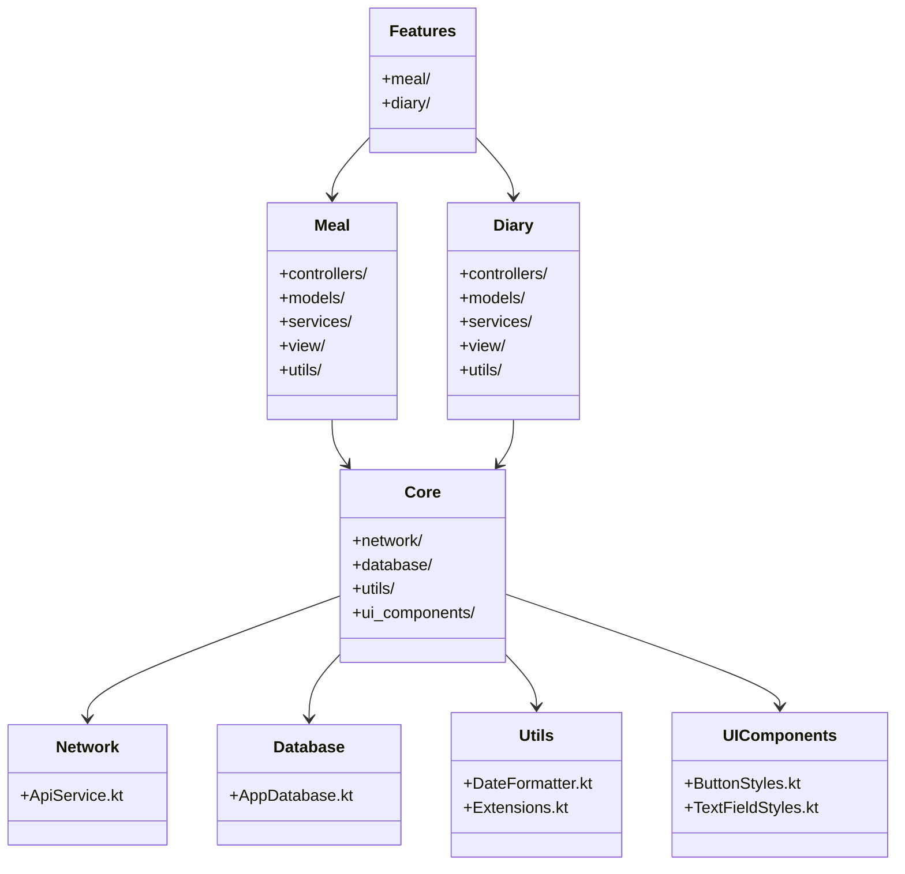
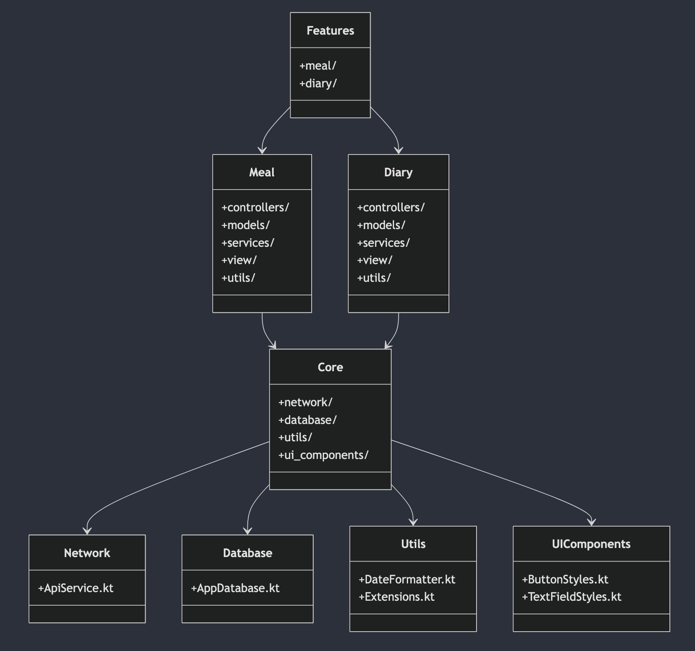

# Mobilki

Проект по дисциплине "Разработка мобильных приложений".

## Описание
Данное мобильное приложение предназначено для ведения дневника питания. Оно позволяет пользователям отслеживать приёмы пищи, управлять списком ингредиентов, анализировать потребляемые калории, белки, жиры и углеводы.

## Структура проекта

```
features/
    meal/  # Модуль, отвечающий за функциональность, связанную с приёмами пищи (блюдами).
        controllers/  # Контроллеры (или Presenters/ViewModels) для обработки действий пользователя и обновления UI.
        models/  # Модели данных, относящиеся к приёмам пищи (например, Meal, Ingredient).
        services/  # Сервисы для выполнения бизнес-логики, связанной с приёмами пищи (например, MealService).
        view/  # UI компоненты, специфичные для отображения информации о приёмах пищи (экраны, виджеты).
        utils/  # Вспомогательные функции, используемые в модуле meal.
    diary/  # Модуль, отвечающий за функциональность дневника питания.
        controllers/  # Контроллеры (или Presenters/ViewModels) для обработки действий пользователя и обновления UI.
        models/  # Модели данных, относящиеся к дневнику питания (например, DiaryEntry).
        services/  # Сервисы для выполнения бизнес-логики, связанной с дневником (например, DiaryService).
        view/  # UI компоненты, специфичные для отображения дневника питания.
        utils/  # Вспомогательные функции, используемые в модуле diary.
core/  # Общие компоненты и утилиты, используемые во всём приложении.
    network/  # Сетевой слой.
        ApiService.kt  # Интерфейс для взаимодействия с API (например, с использованием Ktor).
    database/  # Слой базы данных.
        AppDatabase.kt  # Абстракция базы данных (например, Room Database).
    utils/  # Общие вспомогательные функции.
        DateFormatter.kt  # Форматирование даты и времени.
        Extensions.kt  # Функции расширения Kotlin.
    ui_components/  # Переиспользуемые UI компоненты.
        ButtonStyles.kt  # Стили для кнопок.
        TextFieldStyles.kt  # Стили для текстовых полей.
```

## Технологии

- **Jetpack Compose** – декларативный UI-фреймворк для создания пользовательского интерфейса.
- **Hilt** – библиотека внедрения зависимостей (Dependency Injection), упрощающая управление зависимостями в приложении.
- **kotlinx.coroutines** – библиотека для управления асинхронными операциями, обеспечивающая неблокирующий ввод/вывод.
- **Ktor Client** – HTTP-клиент для выполнения сетевых запросов.
- **Room Database** – ORM для работы с базой данных SQLite.

## UML диаграмма архитектуры



## Скриншот UML



## Лицензия
Проект используется исключительно в образовательных целях. Все права защищены.

